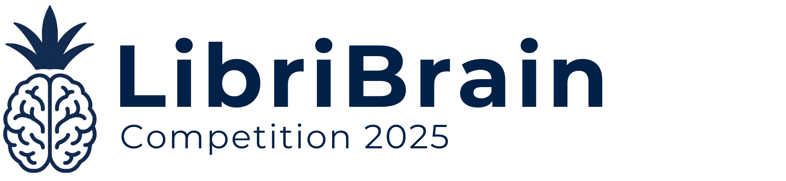

<!-- 

  

 -->

## LibriBrain Competition 2025

  
Now accepting Workshop Papers!

  

    The 2025 LibriBrain Competition has concluded. We thank all teams for participating.
    If you have built something interesting using the LibriBrain dataset, please consider submitting a
    <a href="https://libribrain.com/workshop-paper"
       style="color: inherit; text-decoration: underline;"
       target="_blank" rel="noopener noreferrer">Workshop Paper</a>
    until 09.11.2025 AoE.
  

The **LibriBrain Competition** presented at NeurIPS 2025 invites AI researchers and students to take part in the exciting challenge of non-invasively decoding language from the brain. The societal impact of functioning brain computer interface systems will be substantial - first for people with speech related disabilities, and eventually as a new paradigm for interaction with computers.

We believe that the way forward for advancing this impactful technology is through standardization and easy accessibility for the broader research community. Our goal is to spark an "ImageNet moment" for BCI, lowering the barrier of entry for researchers to contribute to this exciting new field. To this effect, we're excited to announce
- **Deepest MEG dataset to date**: 25–50× deeper than most existing datasets
- **Plug-and-play Python package**: `pip install pnpl`
- **Hands-on tutorials**: Train your first model in under an hour
- **Community & competition**: Prizes 🎁, [leaderboards](https://neural-processing-lab.github.io/2025-libribrain-competition/leaderboard/) 🌐, [Discord](https://neural-processing-lab.github.io/2025-libribrain-competition/links/discord) 🗣️

We're excited to see what you'll build!

  <a href="https://neural-processing-lab.github.io/2025-libribrain-competition/tracks/" style="background-color:#776885;color:white;padding:10px 20px;border-radius:5px;text-decoration:none;font-weight:bold;">Learn more...</a>
  &nbsp;
  <a href="https://neural-processing-lab.github.io/2025-libribrain-competition/participate/" style="background-color:#002147;color:white;padding:10px 20px;border-radius:5px;text-decoration:none;font-weight:bold;">Participate now!</a>

   

  

  

