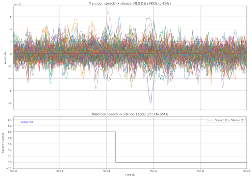

## Tasks
The LibriBrain Competition features two core tasks focused on decoding language from brain activity:
- **Speech Detection**: In this task, participants will train models to recognize when the subject is hearing speech versus silence, using brain activity measured by MEG during a listening session.
- **Phoneme Classification**: In this task, participants will build models to classify the heard phonemes from MEG data collected during a listening session.

We believe that these tasks will provide a strong foundation for advancing future research in language decoding from brain data.
