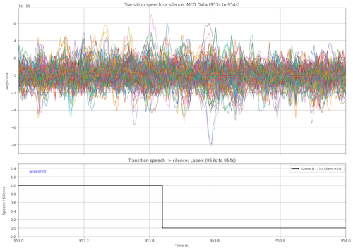

## Tracks
The **LibriBrain Competition** features two core tasks in decoding language from MEG recordings of brain activity:

- **Speech Detection**  
  Train a model to distinguish *speech* vs. *silence* based on brain activity measured by MEG during a listening session.

- **Phoneme Classification**  
  Build a classifier that maps MEG data to the specific **phonemes** being heard.

## Variants

We offer two variants per track to balance resource constraints with open exploration:

| Variant      | Allowed Data               | Focus                                        |
|--------------|----------------------------|----------------------------------------------|
| **Standard** | LibriBrain only            | Level playing field — innovate on methods    |
| **Extended** | Any (public or private)    | Embrace scale — “learn anything you want”    |

> You’re welcome to enter both tracks. Prize money, however, is awarded to each team **only once**: if you place first in both, the second prize rolls down to the next eligible team.

---

We believe these tasks will spark new breakthroughs in language decoding from brain activity. Ready to get started?

